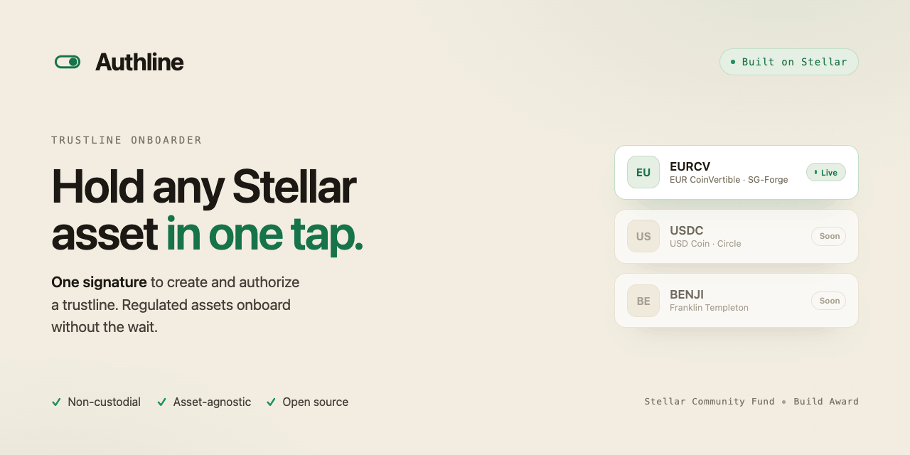

# Authline

**An asset-agnostic standard + reference implementation that lets third parties — exchanges, brokers, wallets — establish authorized trustlines _for_ their users.** Receiving or withdrawing a Stellar classic asset no longer forces the user through a context-free *"create a trustline"* prompt followed by a separate, opaque authorization wait.

The product is a **standard + an integrator SDK + a reference exchange-withdrawal integration**. The end-user "activation page" is just one reference consumer / hosted-redirect target — not the product.

## The invariant (stated openly — it is a strength)

Creating a trustline (`CHANGE_TRUST`, or the CAP-73 `trust()`) **always requires the user's own signature**. No third party can create a trustline on a non-custodial user's account. So "open a trustline for a user" means the third party does **everything else** — pays the reserve (CAP-33 sponsorship), authorizes on the issuer's behalf (permissionless, on-chain), and orchestrates the transaction — reducing the user to **at most one** in-flow signature, and often **zero**.

## Two asset classes

The SDK detects the class from the issuer's `auth_required` flag (`assetAuthRequired`):

| Class | Examples | Onboarding | Authorize step? |
|---|---|---|---|
| **Open** classic asset (the majority) | USDC, EURC | Third party builds + **sponsors** a `ChangeTrust`; user signs once. A sponsored `CreateAccount` covers a brand-new zero-XLM account. | **No** — no Authorizer contract needed. |
| **Regulated** `AUTH_REQUIRED` asset | EURCV | `ChangeTrust` (user, once) **plus** authorize-on-behalf (third party, permissionless, no user/issuer signature) via the **Trustline Authorizer**. | **Yes** — the regulated-asset value. |

## The three cases

```
Case A — user already has an UNAUTHORIZED trustline  (common with AUTH_REQUIRED)
         third party authorizes on-behalf                            → ZERO user signatures

Case B — user has NO trustline / zero XLM
         third party builds a sponsored ChangeTrust (pays 0.5 XLM
         reserve; sponsored CreateAccount if brand-new); user signs   → ONE user signature
         once; then (if AUTH_REQUIRED) authorize on-behalf

Case C — user has a funded account
         one CAP-73 Soroban tx (onboard wrapper): trust() + authorize → ONE user signature
         in a single user signature
```

### How it works (Case C, the one-tx CAP-73 path)

```
        ┌──────────┐   trust()  (CAP-73, Protocol 26)   ┌─────────────────────┐
holder  │ onboard()│ ─────────────────────────────────▶ │  Stellar Asset      │
signs ─▶│  wrapper │                                     │  Contract (SAC)     │
 once   │          │ ─ authorize_trustline() ─┐          └─────────┬───────────┘
        └──────────┘                          ▼                    │ set_authorized
                                   ┌──────────────────────┐        │
                                   │ Trustline Authorizer │◀───────┘  (SAC admin)
                                   │ denylist / allowlist │
                                   └──────────────────────┘
```

1. The issuer keeps the asset `AUTH_REQUIRED` and sets the **Trustline Authorizer** as the SAC admin (`SAC.set_admin`).
2. The holder signs **one** `onboard(sac, authorizer, holder)` transaction.
3. `onboard` runs `SAC.trust(holder)` (CAP-73 creates the trustline) then `authorizer.authorize_trustline(holder)`, which — gated by the denylist / allowlist policy — calls `SAC.set_authorized(holder, true)`.
4. The whole invocation is atomic: any inner failure reverts.

CAP-73's `trust()` has no sponsorship, so this single-tx path is for a **funded** holder. The reserve-free path for a brand-new account (Case B) uses classic sponsored reserves (CAP-33) off-chain.

## Contracts

The contracts (canonical home: [theahaco/stellar-assets](https://github.com/theahaco/stellar-assets)):

| Contract | Status / id | Description |
|---|---|---|
| `trustline-onboard` | **deployed on mainnet** — `CDH2Z3PMBEL2T3EBM3VW5ENDPURYUY7YIKX3XMU3TK5AP4P3LXMPAGLC` | One-signature CAP-73 wrapper: `onboard(sac, authorizer, holder)` → `trust()` + `authorize_trustline` under one `holder.require_auth()`, with a `NotAuthorized` post-condition. Merged (PR #10 / #12). |
| Trustline Authorizer | live today as `eurcv_auth` (mainnet `CB2DHZ…KSB3`); the asset-agnostic generalization is the grant's contract deliverable | SAC-admin authorization policy. **Permissionless** `authorize_trustline(account)` gated by a **denylist** (open-by-default) or **allowlist** policy. Plus `ban`/`freeze`/`deauthorize`/`mint`/`clawback`/`pause`/`upgrade`, an audit-event trail, and admin (`admin`/`set_admin`/`upgrade`); built on admin-sep. |

The Authorizer exposes the minimal interface the wrapper depends on:

```rust
#[contractclient(name = "AuthorizerClient")]
pub trait Authorizer {
    fn authorize_trustline(env: Env, account: Address) -> Result<(), soroban_sdk::Error>;
}
```

## Packages — the integrator SDK

[`packages/sdk`](packages/sdk) — **`@theaha/authline`** (TypeScript). The surface an exchange / broker / wallet uses to onboard a user into an asset:

```ts
import {
  discover,                  // read an issuer's stellar.toml [TRUSTLINE_ONBOARDER] block
  assetAuthRequired,         // open asset vs regulated (AUTH_REQUIRED) — drives the flow
  status,                    // { hasTrustline, isAuthorized } for an address
  buildSponsoredOnboardTx,   // Case B: reserve-free classic ChangeTrust (+ sponsored CreateAccount)
  buildAuthorizeTx,          // permissionless authorize-on-behalf (no user/issuer signature)
  buildOnboardTx,            // Case C: the CAP-73 one-tx (trust + authorize)
  onboardingRequest,         // → { sep7Uri, deepLink, hostedUrl } handoffs
  selectBackend,             // cap73-one-signature vs cap33-sponsored
  resolveOfficialAsset,      // curated, issuer-pinned registry — never resolve by code alone
} from "@theaha/authline";
```

- **`status(address)`** → `{ hasTrustline, isAuthorized }` — short-circuit "already activated".
- **`assetAuthRequired(issuer)`** — open vs regulated; decides whether onboarding includes an authorize step at all.
- **`buildSponsoredOnboardTx()`** — reserve-free classic `ChangeTrust`; the integrator (`sponsor`) pays the 0.5 XLM reserve; optional sponsored `CreateAccount` for a brand-new account. Signers: `sponsor` + `user`.
- **`buildAuthorizeTx()`** — the permissionless authorize-on-behalf Soroban tx; any funded `source` may submit it; **no user signature, no issuer signature**.
- **`buildOnboardTx()`** — the CAP-73 one-tx for a funded holder (Case C).
- **`onboardingRequest()`** → SEP-7 `web+stellar:tx` URI + wallet deep-link + hosted-redirect URL — the three ways to hand a Case-B/C tx to the user to sign once.
- **`discover()`** — auto-discover an issuer's config from its `stellar.toml` `[TRUSTLINE_ONBOARDER]` block, StrKey-validating every advertised address. One issuer config → universal interop, no bilateral deals.
- **`OFFICIAL_ASSETS` / `resolveOfficialAsset()`** — a curated, **issuer-pinned** registry with load-time StrKey validation and a `capability` model (`open` / `permissionedOneStep` / `permissionedManual`): the "never resolve an asset by code alone" anti-copycat defense (aligned with `stellar-assets`). The reference UI surfaces a clawback/freeze warning for assets the issuer can claw back.

A React entry (`@theaha/authline/react`) and an issuer admin CLI accompany the core.

### Reference exchange-withdrawal demo

[`examples/exchange-withdrawal/demo.mjs`](examples/exchange-withdrawal/demo.mjs) — a runnable testnet script proving the RFP's core: **a third party establishes an _authorized_ trustline for a brand-new, zero-XLM user.** It generates fresh exchange + user keypairs, funds the exchange via friendbot, then:

1. **Sponsored trustline creation** (`buildSponsoredOnboardTx`, `createUserAccount: true`) — the exchange pays the reserve; the user signs once (handed off via SEP-7 / hosted URL in a real non-custodial flow).
2. **Authorize-on-behalf** (`authorize_trustline` via the Authorizer) — no user signature, no issuer signature.

Verified on **testnet**, final state `hasTrustline=true isAuthorized=true`:

- Sponsored trustline creation: [`b001cc0f183b5a554b2abb004f0f424227e728354917aafae5aa0fee390464e8`](https://stellar.expert/explorer/testnet/tx/b001cc0f183b5a554b2abb004f0f424227e728354917aafae5aa0fee390464e8)
- Authorize-on-behalf: [`2a1257b2eac34114e0face7f07080bb602c85d573deddd59401a29f55eca6479`](https://stellar.expert/explorer/testnet/tx/2a1257b2eac34114e0face7f07080bb602c85d573deddd59401a29f55eca6479)

```bash
npm install
npm run build --workspace @theaha/authline
node examples/exchange-withdrawal/demo.mjs   # requires the Rust `stellar` CLI on PATH (see Status)
```

[`examples/exchange-withdrawal/demo-open.mjs`](examples/exchange-withdrawal/demo-open.mjs) — the **open-asset** path (the majority case: not `AUTH_REQUIRED`, like USDC/EURC). The exchange establishes the trustline for a brand-new zero-XLM user (`buildSponsoredOnboardTx`, sponsored — one user signature), `assetAuthRequired` returns `false` so there is **no authorize step**, and the user immediately receives the asset. Runs fully in JS (no Soroban). Verified on testnet:

- Sponsored trustline creation: [`97e284ca…`](https://stellar.expert/explorer/testnet/tx/97e284cae42ed4f21f2742f8a0afb793588672268435b52bec7c5b611ea03ed0)
- Payment received (100 OPENX): [`354abf7c…`](https://stellar.expert/explorer/testnet/tx/354abf7c716e7fca01d5a78c1e15530842d61a134ec4197cfc745db3418fd9f7)

```bash
node examples/exchange-withdrawal/demo-open.mjs   # pure JS, no CLI needed
```

## Status

| Component | State |
|---|---|
| **EURCV onboarder** (`eurcv_auth`) | **LIVE on mainnet** — denylist SAC-admin authorizer for SG-Forge's EURCV euro stablecoin. Contract [`CB2DHZMQHQE3TGUMD6BRM7UCJZNIPKDRVEQOWBIRRS3G2FZOGDTRKSB3`](https://stellar.expert/explorer/public/contract/CB2DHZMQHQE3TGUMD6BRM7UCJZNIPKDRVEQOWBIRRS3G2FZOGDTRKSB3) (repo private; available on request). |
| **CAP-73 one-signature wrapper** | **MERGED** — generic `onboard(sac, authorizer, holder)` + curated multi-asset registry (USDC/EURC/EURCV) in [`theahaco/stellar-assets` PR #10](https://github.com/theahaco/stellar-assets/pull/10) (merged 2026-06-05, public). Contract-level tested (incl. a `NotAuthorized` post-condition); end-to-end one-signature on a live wallet + mainnet rollout still to be exercised. |
| **Contract Admin SEP** | admin-sep — [`theahaco/admin-sep`](https://github.com/theahaco/admin-sep) (SDF discussion #1670). |
| **Canonical home** | The contracts, the `@theaha/authline` SDK, the Authline dApp, the SEP, and the demos are **merged in [theahaco/stellar-assets](https://github.com/theahaco/stellar-assets)** (the canonical repo); the onboard wrapper is **deployed on mainnet** (`CDH2Z3PM…`). This repo was the SCF staging fork; the ids above are its testnet deployments. |
| **SDK + dApp** | **MERGED** in [theahaco/stellar-assets](https://github.com/theahaco/stellar-assets) (PR #13 / #14), security-reviewed; the open-asset path is in review (PR #16). |

> **P26 JS-SDK note (honest caveat).** The JS `@stellar/stellar-sdk` (15.1.0) cannot yet **decode** a Protocol-26 Soroban simulation response that **writes a trustline flag**. The SDK **builds** the correct authorize-on-behalf transaction, but the demo **submits** it via the Rust `stellar` CLI / RPC, which is authoritative on Protocol 26. Classic flows (sponsored trustline, `status`, SEP-7) run in pure JS. This resolves when upstream ships P26 decode support.

## Discovery

Issuers publish a `stellar.toml` `[TRUSTLINE_ONBOARDER]` block (asset, sac, authorizer, onboard wrapper, policy, backends). Any integrator auto-discovers it via `discover()` → one issuer config → universal interop, **no bilateral deals**. Contrast with today: issuers approve trustlines by hand or run a SEP-8 approval server that co-signs every transaction; Authline delegates authorization **once** to a permissionless on-chain contract.

The standard is drafted in [`sep/SEP-XXXX-trustline-onboarder.md`](sep/SEP-XXXX-trustline-onboarder.md).

## Build & test

```bash
# contracts: native unit/integration tests
cargo test

# contracts: build deployable wasm
cargo build --release --target wasm32v1-none

# lint
cargo clippy --all-targets && cargo fmt --check

# SDK
npm install
npm run build --workspace @theaha/authline

# activation page (dev) — the reference hosted-redirect consumer
npm run dev --workspace trustline-onboarder-app
```

## Project structure

```
.
├── contracts/
│   ├── trustline-authorizer/      # asset-agnostic SAC-admin authorization policy (Rust/Soroban)
│   └── trustline-onboard/         # one-signature CAP-73 wrapper (Rust/Soroban)
├── packages/sdk/                  # @theaha/authline — integrator SDK (TypeScript)
├── examples/
│   └── exchange-withdrawal/       # reference third-party withdrawal demo (testnet)
├── app/                           # Authline dApp — recipient-side activation UI (Vite + React + Stellar Wallets Kit)
├── sep/                           # SEP-XXXX: Trustline Onboarder (draft)
├── ARCHITECTURE.md                # technical architecture
└── environments.toml              # Scaffold Stellar network/deploy config
```

## License

[Apache-2.0](LICENSE).
